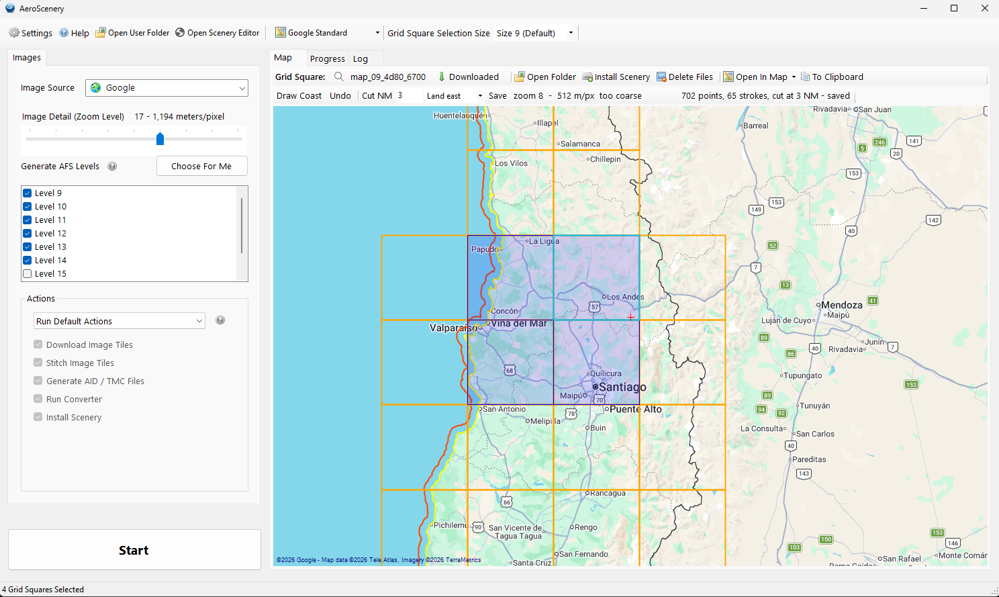

# AeroScenery — photoscenery for Aerofly FS 4

AeroScenery builds photoscenery for Aerofly FS 4 from aerial imagery. You pick an area on a map.
The app downloads the imagery, stitches it, converts it into Aerofly's `.ttc` tiles and installs it
as an add-on. Then you fly over it.

This is a fork. It stands on two earlier projects, and it would not exist without them:

- **[AeroScenery](https://github.com/nickhod/aeroscenery)** by **Nick Hoddinott**, who wrote the
  app: the map, the grid, the downloaders for many imagery sources, the stitcher and the whole
  pipeline.
- **The community mods a to j** by **Christophe ([@chrispriv](https://github.com/chrispriv))**,
  who carried AeroScenery forward to Aerofly FS 4 and added a moving map, elevation data, OSM
  downloads, tooltips for new users and much more.

This fork does one thing: photoscenery. It keeps the path from download to install, removes the
features that path does not use, and replaces the conversion step with a converter of its own.



## What is new in this fork

- **A built-in converter.** The app writes the `.ttc` tiles itself. It needs no GPU, no desktop
  session and no IPACS SDK — nothing to download besides the app. On a comparable workload it was
  about 40 times faster than IPACS' GeoConvert. Its output is checked byte for byte against an
  independent reference implementation of the format.
- **A cut at the coastline.** Aerial imagery stops somewhere at sea, and where it stops it leaves
  a straight edge or a black area. Draw the waterline on the map, and the converter stops the
  photoscenery a set distance out to sea (3 NM by default), along the shape of the coast. Aerofly's
  own sea shows beyond it.
- **Install as an Aerofly add-on.** Scenery goes to
  `Documents\Aerofly FS 4\addons\scenery\<package>\images\<grid square>\`, the layout Aerofly
  add-ons use. Each area can be its own package, and an install never touches another area.
- **Faster downloads.** Many simultaneous downloads now really run in parallel. With Bing, a full
  grid square at zoom 17 — about 65,000 image tiles — downloads in about four minutes.

The whole list, with the measurements behind each change, is in [CHANGELOG.md](CHANGELOG.md).

## Requirements

- Windows 10 or 11. The .NET Framework 4.8 runtime it needs is already part of Windows.
- Aerofly FS 4 on Windows. The scenery does not work on the Android version of Aerofly: the
  converter writes BC1 textures, and mobile GPUs need ETC2. On Android the colours come out as
  purple and green noise.
- Disk space. At zoom 17, one level 9 grid square (about 65 km across) is about 3.6 GB installed,
  plus its downloaded tiles and stitched images in the working folder.
- Memory. Converting one grid square at zoom 17 uses about 7 GB at its peak.

## Quick start

1. Download `AeroScenery-<version>.zip` from the
   [latest release](https://github.com/jlgabriel/aeroscenery-fs4/releases/latest). Unpack it
   anywhere and run `AeroScenery.exe`. There is nothing to install.
2. Open **Settings**. Check the **Working Folder**, where downloads and intermediate files go, and
   set a **Scenery Package Name**, for example `my_area`. Leave **AFS User Folder** empty: the app
   finds `Documents\Aerofly FS 4` by itself.
3. On the **Map** tab, keep **Grid Square Selection Size** at 9 and click the squares you want.
   The status bar shows how many are selected.
4. Choose an **Image Source** and an **Image Detail (Zoom Level)**, then click **Choose For Me**
   under **Generate AFS Levels**. The deepest level must match the zoom, or the extra detail is
   thrown away.
5. Under **Actions**, keep the default actions and click **Start**.
6. When the run finishes, start Aerofly FS 4 and fly there.

A full level 9 square at zoom 17 takes about 12 minutes from start to installed on an SSD. Most of
that is download and stitching.

The [user guide](docs/user-guide.md) goes through each step, and through drawing a coastline.
The [`.ttc` format description](docs/ttc-format.md) is for those who want to know how the tiles
are made.

## Imagery sources and their terms

The app can download from Bing, Google, ArcGIS and several national mapping agencies. Some of these
need an API key, which you set under *Settings > Image Source Accounts*.

**You are responsible for how you use the imagery.** Each source has its own terms of use, and
some do not allow what this app does. Read the terms of the source you choose, and use the result
for your own flying.

## Problems and feedback

Report a bug or ask for a feature in the
[GitHub issues](https://github.com/jlgabriel/aeroscenery-fs4/issues). Attach the log,
`Documents\AeroScenery\aeroscenery.txt`, if the problem happened during a run. For questions and
general discussion, use the
[thread on the Aerofly forum](https://www.aerofly.com/community/forum/index.php?thread/30158-aeroscenery-2-0-for-aerofly-fs-4-photoscenery-with-a-built-in-converter/).

## Where things live

| | |
|---|---|
| Working files | `<Working Folder>\<grid square>\` |
| The drawn coastline | `<Working Folder>\coastline.txt` |
| Installed scenery | `Documents\Aerofly FS 4\addons\scenery\<package>\images\<grid square>\` |
| Log | `Documents\AeroScenery\aeroscenery.txt` |
| Settings | `Documents\AeroScenery\settings.xml` |

There is no database. The grid squares shown as downloaded are the folders in the working folder:
Aerofly names a square after its level and the hex of its south west corner, so the folder name
gives back the coordinates. To forget a square, delete its folder.

A finished conversion leaves its `.ttc` files in `<grid square>\<source>\<zoom>-geoconvert-ttc\`:
1 + 4 + 16 + 64 = 85 for levels 9–12, and 1,365 for levels 9–14. That count, not the progress
label, is what says it worked. A square cut at the coastline has fewer tiles, plus `_mask.ttc`
files along the cut.

## Building

No .NET SDK and no Visual Studio needed, only the Build Tools and the .NET Framework 4.8 Developer
Pack. Restore the NuGet packages first, then build. A fresh clone does not build without the
restore:

```powershell
$msbuild = "C:\Program Files (x86)\Microsoft Visual Studio\18\BuildTools\MSBuild\Current\Bin\amd64\MSBuild.exe"
& $msbuild AeroScenery\AeroScenery.sln -t:restore -p:RestorePackagesConfig=true
& $msbuild AeroScenery\AeroScenery.sln -t:Build -p:Configuration=Release -m -nodeReuse:false
```

The path to `MSBuild.exe` changes with the version of the Build Tools. Adjust `$msbuild` to your
installation. Close the app before you build — a running `AeroScenery.exe` locks its output file.

After the restore, `.\package.ps1 -Build` builds and writes the release zip to `dist\`.

## Projects

- **AeroScenery** — the application
- **AeroSceneryConvert** — the same converter as a console program, for scripts. See its
  [README](AeroSceneryConvert/README.md).
- **tools/** — developer tooling, not part of the release: the reference implementation of the
  `.ttc` format and its test suites, the coastline checks, and the command-line tools described in
  [docs/advanced-tools.md](docs/advanced-tools.md).

## License

GPL-3.0, the same as the original. Original AeroScenery by **Nick Hoddinott**; community mods by
**Christophe (@chrispriv)**. The `.ttc` converter is a reimplementation from the file format, not
IPACS code. Aerofly FS is a trademark of IPACS; this project is not affiliated with IPACS.
