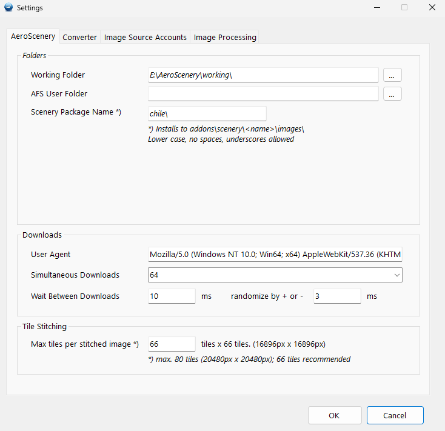
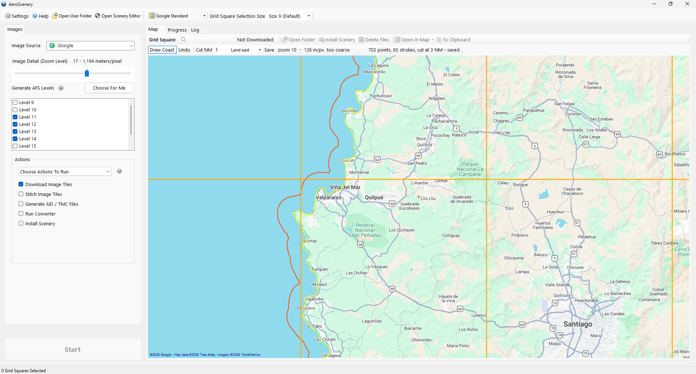

# User guide

This guide goes from an empty app to photoscenery you can fly over in Aerofly FS 4. The
[README](../README.md) has the short version.

The scenery is for Aerofly FS 4 on Windows only. The Android version of Aerofly needs textures in
a different format (ETC2), and it shows these tiles with the wrong colours.

## 1. Settings

Open **Settings** on the toolbar before your first run. Click **OK** to save; **Cancel** keeps what
was there.

**AeroScenery tab**

| Setting | What it does |
|---|---|
| Working Folder | Where downloads, stitched images and converted tiles go. It gets big — put it on a disk with room, an SSD if you can. |
| AFS User Folder | Leave it empty. The app finds `Documents\Aerofly FS 4`, then `Aerofly FS 2`. Set it only if yours is somewhere else. |
| Scenery Package Name | The add-on folder the scenery installs into, under `addons\scenery\`. Lower case, no spaces. Use one name per area. |
| Simultaneous Downloads | How many image tiles download at once. 64 works well with Bing. You can type a number that is not in the list. |
| Wait Between Downloads | A pause after each tile, in milliseconds, with a random part. The defaults are fine. |
| Max tiles per stitched image | How big each stitched image is. 66 is recommended. |

**Converter tab**

| Setting | What it does |
|---|---|
| Write Images With Mask | Writes a `_mask.ttc` beside each tile that is only partly covered, so Aerofly's own imagery shows where there is no photo. Keep it on. |
| Shrink TMC grid squares by | Moves the edges of each square in by this many degrees before conversion, so that a square does not spill into its neighbours. Keep the default. |
| Converter threads | Threads for the tile encoder. *Automatic* uses half the machine, so the computer stays usable during a run. |
| Cut at the coastline | Stops the photoscenery at the coastline you draw on the map. See section 5. It does nothing until you draw a line. |

**Image Source Accounts tab** holds the API keys for the sources that need one (Linz, Mapbox,
HERE). **Image Processing** can change brightness, contrast, colour and sharpness before the
images are converted. After you change it, run *Stitch Image Tiles* again.

## 2. Choose the area

On the **Map** tab, the grid on the map is Aerofly's own grid. Keep **Grid Square Selection Size**
at 9: a level 9 square is about 65 km across, and it is the unit the app works in best.

- Click a square to select it. Click it again to clear it.
- **The status bar shows how many squares are selected.** Check it before you start. A selection
  stays after a run finishes, so the squares of the last run are still selected when you add new
  ones.
- Squares that already have a folder in the working folder show as downloaded.
- **Map Type** changes the base map. Click the button to switch between satellite and a drawn map,
  or use the arrow for the full list. The base map is only for looking; it does not change the
  imagery that is downloaded.

## 3. Choose the imagery

- **Image Source** — where the imagery comes from. Bing and Google cover the whole world. Each
  national source covers its own country.
- **Image Detail (Zoom Level)** — how sharp the imagery is. Each step up is twice as sharp and four
  times the download. Zoom 17 is about 1 m per pixel.
- **Generate AFS Levels** — the tile levels to build. Click **Choose For Me** after you set the zoom.

The deepest level has to match the zoom. If it does not, the extra detail is downloaded and then
thrown away. For a size 9 square, *Choose For Me* picks:

| Zoom | Levels |
|---|---|
| 15 or lower | 9 – 12 |
| 16 | 9 – 13 |
| 17 | 9 – 14 |
| 18 | 9 – 15 |

Read the terms of the source you choose. Each one has its own, and you are responsible for how you
use the imagery.

## 4. Run it

Under **Actions**, *Run Default Actions* runs every step in order:

1. **Download Image Tiles** — fetches the imagery. Tiles already on disk are not fetched again, so
   a run that stops can simply be started again.
2. **Stitch Image Tiles** — joins the tiles into large images.
3. **Generate AID / TMC Files** — writes the files that tell the converter where the images are
   and which levels to build.
4. **Run Converter** — writes Aerofly `.ttc` tiles. If you drew a coastline, the cut happens here.
5. **Install Scenery** — copies the tiles into
   `Documents\Aerofly FS 4\addons\scenery\<package>\images\<grid square>\`.

Choose *Choose Actions To Run* to run only some of the steps — for example to convert again after you
change the coastline, without downloading anything.

Click **Start**. The **Progress** tab shows each step and a clock. The **Log** tab, and
`Documents\AeroScenery\aeroscenery.txt`, say what happened, square by square.

When the run ends, start Aerofly FS 4 and fly to the area. Installing a square again replaces what
was there: the tiles the new build no longer makes are removed from its install folder.

**How to tell that a square worked:** count the `.ttc` files in
`<grid square>\<source>\<zoom>-geoconvert-ttc\`. Levels 9–12 give 85, levels 9–14 give 1,365. A
square cut at the coastline has fewer, plus `_mask.ttc` files along the cut.

## 5. Stop the photoscenery at the coast

Aerial imagery stops somewhere at sea. Where it stops, it leaves a straight edge or a black area,
and both are very visible from the air. Aerofly FS 4 has no water rendering of its own — its sea is
imagery too, only much coarser — so the best result is to keep your photoscenery near the coast
and let Aerofly's sea take over beyond it.

You draw the **waterline**. The converter cuts a set distance out to sea from it, along the shape of
the coast. The default is **3 NM**, which is about how far the real photography reaches: past the
first few kilometres, most imagery at sea is flat fill.

**To draw:**

1. Set **Map Type** to **Bing Satellite Map**. It is the imagery you will build from, so you trace
   exactly what you will get.
2. Zoom in until the toolbar shows **50 m/px or finer**. It warns *too coarse* below that.
3. Click **Draw Coast**, then drag along the waterline. Release the button to pan, and carry on.
   The arrow keys pan, and the map pans when you draw to its edge. **Ctrl+Z** or **Undo** removes
   the last stroke.
4. Set the distance out to sea in **Cut NM**.
5. Set which side of the line is **land** in the dropdown next to it. *Land east* is right for a
   coast that faces west, *land west* for one that faces east, and *land north* or *land south* for
   a coast that runs east–west. The cut on the map moves to the other side as soon as you change
   it, so you can check it by eye.

The line saves itself after every stroke, to `<Working Folder>\coastline.txt`. There is one line
for the whole working folder, so neighbouring squares always agree about their shared edge.

**Rules that matter:**

- **Draw the waterline, not the edge you want.** To keep more sea, change *Cut NM*. A line drawn out
  at sea moves what the line means, and the cut then lands in the part of the imagery that is not a
  photograph.
- **Draw past both edges of every square you build.** A square is cut only if it lies wholly inside
  the stretch of coast the line covers: its latitudes for a coast that runs north–south, its
  longitudes for one that runs east–west. A square across or past an end of the line converts
  without a cut, and the log says so. Past its ends the converter can only guess where the coast
  goes.
- **The order of strokes does not matter.** They join by geography. You can draw in either
  direction, and add to either end on another day.
- **A gap stays a gap.** A stretch you did not draw becomes a straight line. The toolbar shows
  `GAP n km` when a gap is wide enough to move the cut.
- **One line has one land side.** The cut suits a long coast, mainly north–south or mainly
  east–west. It does not suit an island all round, or a coast that turns back on itself.

A square that lies wholly past the cut produces no tiles at all. That is a result, not an error:
there is no photoscenery in that square. The installer leaves its install folder alone and says so
in the log; delete that folder yourself.

## 6. Tidy up

- **Delete Files** on the grid square toolbar removes a square's downloaded tiles, stitched images
  or converted tiles, and never touches the installed scenery.
- The stitched images are the biggest part of the working folder. Once a square is installed and
  you like it, you can delete them. You need them again only to convert that square again.
- To keep a copy of an installed square, move it **outside** `addons\scenery`. Aerofly reads every
  `.ttc` under that folder, whatever the folder names, so a copy inside it still loads.
